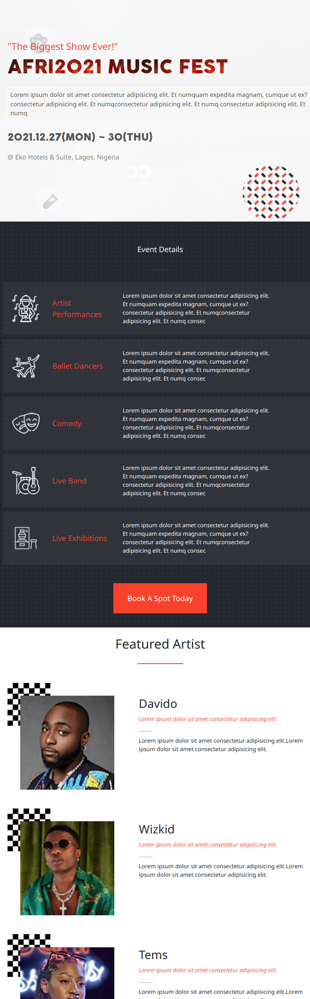

# AfriMusic Festival
This website is for 5-days music festival. Interested participants can have an overview of what the music fest will be like and see a list of performing acts and artists.

## Built With 
- Html
- Css
- Javascript

## Online Version Link
[Click on the link to veiw the online version](https://olawalecoder.github.io/Conference-Page/)

## Getting Started

To get a local copy up and running follow these simple example steps.

Clone the repo with <git@github.com:olawalecoder/Conference-Page.git>

Run cd <RestoreauntApi> to navigate to the project folder
Run <npm install> from the command line
Run <npm start> to start the local server in the browser
 
# Prerequisites
 - Have <git> installed
 - Have a text editor installed
 - Have a browser installed

## Author 
- GitHub: [@olawalecoder](https://github.com/olawalecoder)
- Twitter: [@olawalecoder](https://twitter.com/olawalecoder)
- LinkedIn: [LinkedIn](https://linkedin.com/in/bamidele-olawale-072975142)

## 🤝 Contributing
Contributions, issues, and feature requests are welcome!

Feel free to check the issues page.

## Show your support
Give a ⭐️ if you like this project!

## Acknowledgments

Thanks to [Cindy Shin](https://www.behance.net/adagio07) for her design to build this project.

